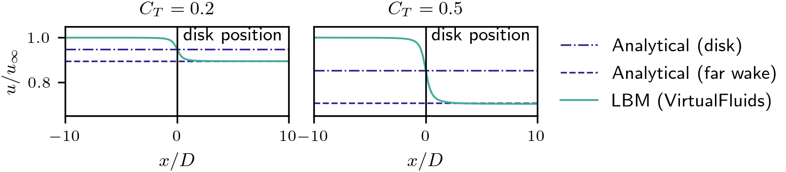

<!-- SPDX-License-Identifier: CC-BY-4.0 -->
<!-- SPDX-FileCopyrightText: Copyright © VirtualFluids Project contributors, see AUTHORS.md in root folder -->

# Overview

This demo case runs an actuator disk simulation in VirtualFluids using the GPU-accelerated cumulant Lattice Boltzmann Method (LBM) together with the actuator-farm interface. The case is a compact verification setup for the actuator disk force projection. A uniform inflow passes through a disk with prescribed thrust coefficients, and the resulting centerline velocity deficit is compared with the analytical result from one-dimensional momentum theory.

The Python driver script reads the case parameters from `disk_config.cfg`, runs one simulation for each configured thrust coefficient, writes raw simulation output, and post-processes the averaged probe-plane data into a velocity comparison plot.

## Folder structure

The demo case contains the following main files and folders:
- `./data/`: data needed by the case and example post-processing output.
  - `./data/output/`: raw simulation output created by `disk_run.py`
  - `./data/post/`: post-processed simulation output created by `disk_run.py`
- `disk_run.py`: Main Python script for running and post-processing the actuator disk case
- `disk_config.cfg`: Simulation configuration
- `disk_postprocess.py`: Post-processing utilities for extracting and plotting centerline velocities

# Simulation case description

The simulation models a circular actuator disk with:
- disk diameter `D = 1.0 m`
- disk center at `(10D, 10D, 10D)`
- disk normal aligned with the streamwise `x`-direction
- inflow velocity `u_infty = 5 m/s`
- thrust coefficients `C_T = 0.2` and `C_T = 0.5`
- air properties `nu = 1.56e-5 m**2/s` and `rho = 1.225 kg/m**3`

The written Python app uses:
- cumulant lattice Boltzmann method (LBM) with LBM Mach number `Ma = 0.1`
- QR turbulence model
- Actuator Line Method (ALM) force projection through `ActuatorFarmStandalone`
- prescribed actuator disk force coefficients derived from one-dimensional momentum theory
- one uniform grid level for the verification setup

The actuator disk is not a blade-resolved aerodynamic model. Instead, it distributes a prescribed global thrust over actuator points so that the integrated force matches the target momentum extraction. The analytical reference is based on the standard actuator disk relation

$$
C_T = 4a(1-a),
$$

where `a` is the axial induction factor. The disk velocity and far-wake velocity are then

$$
U_d = U_\infty(1-a), \qquad U_{far} = U_\infty(1-2a).
$$

These values are used in the post-processing step as the reference levels for the simulated centerline velocity.

## Actuator disk setup

The disk is represented by actuator points distributed in radius and azimuth:
- `number_of_blades = 50`
- `number_of_actuator_line_points_per_blade = 40`
- `smearing_width_per_dx = 2`
- `number_of_cells_per_diameter = 9`

The variable `number_of_blades` acts as the number of azimuthal actuator lines around the disk. Together with the radial actuator points, it defines the point distribution used to approximate the disk area. For each radial point, `disk_run.py` computes an annular area contribution and a local normal-force coefficient. The local coefficients are chosen such that the sum of all actuator-point forces corresponds to the prescribed thrust coefficient.

The force model therefore preserves the global disk thrust while providing a smooth force distribution for the LBM solver. This makes the case useful for checking the coupling between the Python setup, the actuator force projection, the GPU solver, and the probe-based post-processing.

## Boundary conditions

The boundary conditions are:
- inlet: uniform velocity at the `x-min` boundary
- outlet: non-reflective pressure boundary at the `x-max` boundary
- side walls: free-slip boundaries in the `y`- and `z`-directions

The flow is initialized with the inlet velocity in the full domain. The actuator disk then creates a velocity deficit around the disk and in the downstream wake.

# Domain and mesh

The case uses a cubic domain in normalized disk-diameter coordinates:
- domain size: `20D * 20D * 20D`
- domain bounds: `(0, 0, 0)` to `(20D, 20D, 20D)`
- disk center: `(10D, 10D, 10D)`
- grid resolution: `9` cells per disk diameter
- grid spacing: `dx = D / 9`
- number of grid refinement levels: `1`

A probe plane is placed at the disk-center height:
- probe type: `z`-plane
- probe position: `z = 10D`
- probe extent: `0 <= x <= 20D`, `0 <= y <= 20D`

The post-processing extracts the line through the disk center from this probe plane and compares the time-averaged streamwise velocity with the analytical disk and far-wake velocities.

# Outputs

For each thrust coefficient, the script writes raw outputs under `./data/output/`:
- `ct_0p20/`: output for `C_T = 0.2`
- `ct_0p50/`: output for `C_T = 0.5`

Each case directory can contain:
- `fields/`: 3D flow-field output
- `loads/`: actuator load output
- `zplane/`: probe-plane output used for velocity extraction

The script also writes post-processed output under `./data/post/`, including:
- `velocities.png`

Before a new run starts, `disk_run.py` removes the old `./data/output/` and `./data/post/` folders and recreates them for the current simulation.

# Example results

The velocity plot compares the normalized LBM centerline velocity with the analytical actuator disk values for the configured thrust coefficients. The vertical line marks the disk position. The dash-dotted horizontal line shows the analytical disk velocity, and the dashed horizontal line shows the analytical far-wake velocity.



# How to setup and run

The below setup describes how to set up and run using a Linux terminal. Running the C++/CUDA-based flow solver requires an NVIDIA graphics card. Get the VirtualFluids repository and its post-processsing repository
```
git clone "https://git.rz.tu-bs.de/irmb/VirtualFluids.git"
cd VirtualFluids
git clone "https://source.coderefinery.org/wind_energy_uu/virtualfluidspostprocessing.git"
```
Pip install the python-binding of VirtualFluids, which is called "pyfluids". Build it specifically for the GPU-apps.
```
pip install . -C "cmake.args=-DVF_ENABLE_GPU=ON"
```
Pip install the virtualfluids postprocessing package
```
pip install ./virtualfluidspostprocessing/
```
Run the actuator disk app
```
python3 Python/actuator_line_disk/disk_run.py
```
The created output can be found in `./Python/actuator_line_disk/data/output/` and `./Python/actuator_line_disk/data/post/`.