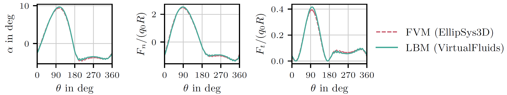
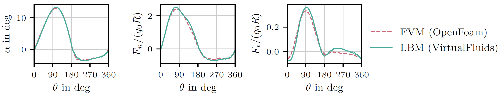
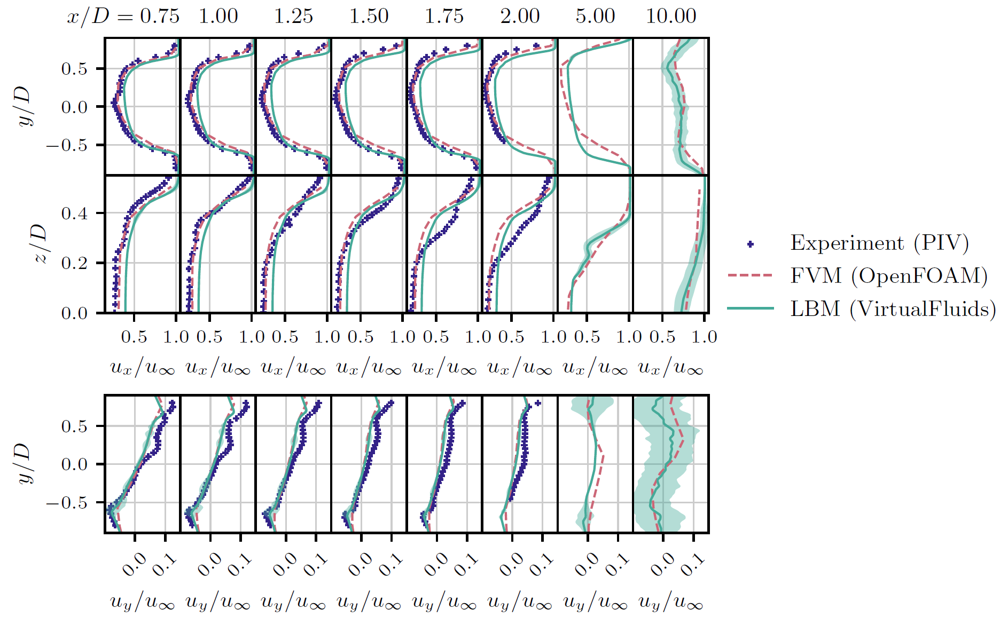
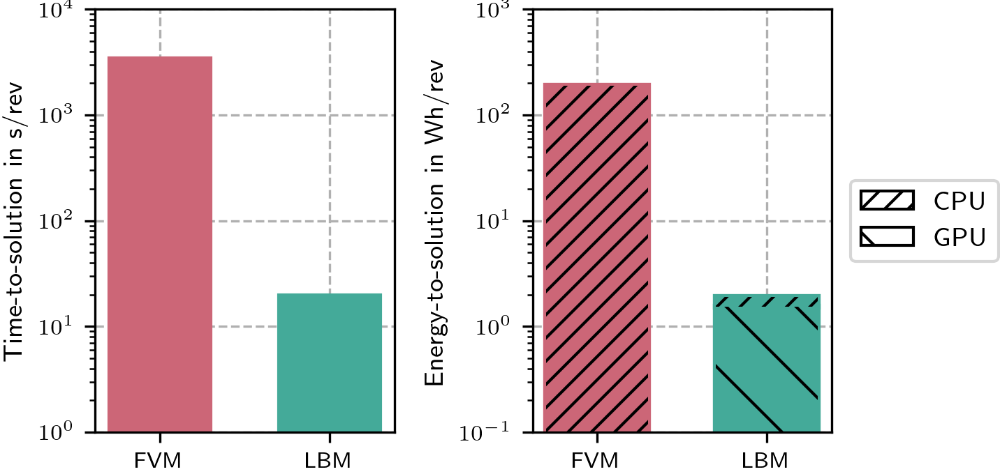

<!-- SPDX-License-Identifier: CC-BY-4.0 -->
<!-- SPDX-FileCopyrightText: Copyright © VirtualFluids Project contributors, see AUTHORS.md in root folder -->

# Overview

This demo case runs a Vertical Axis Wind Turbine (VAWT) simulation in VirtualFluids using the GPU-accelerated cumulant Lattice Boltzmann Method (LBM) together with a VAWT actuator-line model (ALM). The case is organized into three separate configurations that mirror the structure of the paper:
- Verification: simplified cross-solver benchmark against EllipSys3D
- Validation: TU Delft benchmark with airfoil data and VAWT engineering corrections
The Python driver script selects the case through a config file passed as a command-line argument. It then runs the simulation, writes raw outputs, and post-processes the results into figures such as blade loads, wake profiles, and performance plots.

## Folder structure

The demo case contains the following main files and folders:
- `./data/`: all data needed for the simulations and also the data created by the simulations.
  - `./data/raw/`: raw simulation output
  - `./data/post/`: post-processed simulation output
  - `./data/airfoil/`: airfoil polar data used by the ALM
- `vawt_run.py`: Main Python script for running and post-processing the VAWT case
- `vawt_config_verification.cfg`: Simplified verification setup
- `vawt_config_validation.cfg`: TU Delft validation setup
- `vawt_postprocess.py`: Post-processing utilities for wake, loads, and performance analysis

# Simulation case description

The simulation models a two-bladed straight-bladed VAWT with:
- two straight NACA0018 blades
- rotor diameter `D = 1.0 m`
- rotor height `H = 1.0 m`
- blade chord `c = 0.06 m`
- zero pitch
- mounting point at `0.4c`
- tripped blade polars at `Re_c = 1.6 * 10**5`
- tip-speed ratio `lambda = 4.5`
- inflow velocity `u_infty = 9.3 m/s`
- air properties `ν = 1.56e-5 m**2/s` and `rho = 1.225 kg/m**3`

The written Python-app uses:
- cumulant lattice Boltzmann method (LBM) (with -LBM Mach number `Ma = 0.1` and quadric limiter `0.001`)
- QR turbulence model
- Actuator Line Method (ALM)
- End effects model
- Flow curvature model

Across all three cases, the boundary conditions are:
- inlet: uniform velocity
- outlet: non-reflective pressure boundary
- side walls: free-slip boundaries
These settings match the general numerical framework described in the paper.

## Case structure

### 1. Verification case

The verification case corresponds to the simplified VAWT cross-solver benchmark from the paper. In that setup, the goal is to isolate the VAWT-ALM implementation by disabling the VAWT-specific engineering corrections and using a simplified aerodynamic model. The paper setup uses a linear polar, disables flow-curvature and end-effects corrections, runs for `100` revolutions, samples statistics over the last `20` revolutions, and uses `80` actuator-line points per blade together with `80` cells per diameter on the finest mesh. The current demo config is a lighter and faster version of that case:
- `number_of_cells_per_diameter = 20`
- `number_of_actuator_line_points_per_blade = 20`
- `number_of_grid_refinement_levels = 2`
- `smearing_width_per_dx_fine = 5`
- `flag_flow_curvature = false`
- `flag_end_effects = false`
- `name_airfoil_data = thin_airfoil_theory`
- `name_airfoil_data = NACA0018c60mm_Re160k_tripped` (experimental airfoil polar for the tripped airfoil at fixed Reynolds-number.)
- `number_of_revolutions_simulation_end = 100`

So this config preserves the same case logic, but at a reduced numerical resolution compared to the paper reference. The paper benchmark uses `number_of_cells_per_diameter = 80`, `number_of_actuator_line_points_per_blade = 80`, and `number_of_grid_refinement_levels = 4`, resulting in about `3.8 * 10**7` cells in total.

### 2. Validation case

The validation case represents the TU Delft VAWT benchmark described in the paper. There, the model is compared against PIV data and an FVM-based LES reference. The benchmark includes both the flow-curvature and end-effects corrections. In the paper, each blade is represented by `80` actuator-line points, and the smearing width is treated in a localized way based on chord, drag, and mesh size. The current demo validation config is again a reduced-cost version:
- `name_airfoil_data = NACA0018c60mm_Re160k_tripped`
- `flag_flow_curvature = true`
- `flag_end_effects = true`
- `number_of_cells_per_diameter = 20`
- `number_of_actuator_line_points_per_blade = 20`
- `number_of_grid_refinement_levels = 2`
- `smearing_width_per_dx_fine = 2`
- `FLAG_LOCALIZED_SMEARING = true`
- `name_airfoil_data = thin_airfoil_theory` (thin airfoil theory linear lift polar, drag is zero)
- `number_of_revolutions_simulation_end = 100`

This makes the case much faster to run while still reflecting the intended validation setup from the paper. The paper benchmark uses `number_of_cells_per_diameter = 80`, `number_of_actuator_line_points_per_blade = 80`, and `number_of_grid_refinement_levels = 4`, resulting in about `3.8 * 10**7` cells in total.

### 3. Performance case

The performance case is based on the same simplified configuration used for the cross-solver verification setup (EllipSys3D vs. VirtualFluids). The current run-script does not include the automatic recording of energy-to-solution (E2S), but `vawt_postprocess.py` provides the python-classes for tracking energy usage of the CPU and GPU at run-time (`CPUEnergyMonitor` and `GPUEnergyMonitor`) as well as a plotting function for it (`plot_performance`). In the paper, the corresponding cross-solver comparison showed that the LBM setup completed the case about 410* faster than the FVM reference and required about 0.6% of the FVM energy-to-solution for comparable blade-load accuracy.

# Domain and mesh

Both configs use the same domain layout in normalized rotor-diameter coordinates:
- coarsest domain: `25D * 8D * 8D`
- finest region: `12D * 2D * 2D`
- turbine center: `(5D, 4D, 4D)`
- `number_of_grid_refinement_levels = 2` (in the paper 4 instead of 2)

# Outputs

Depending on the chosen config, the script writes several raw outputs (stored in `./data/raw/`), including:
- 3D field output
- probe-plane data
- actuator-line load data
Probe planes can be written in `x`, `y`, and `z`, depending on the config. The current configs mainly define `x`-planes for wake extraction. Further, the script writes post-processed outputs (stored in `./data/post/`), including:
- `loads.png`
- `wake.png`
The exact outputs depend on the selected config:
- verification: mainly blade-load comparison
- validation: blade loads and wake profiles

# Example results

Q-criterion isosurface colored by velocity magnitude.


Verification / validation loads: The load plot corresponds to the azimuthal variation of angle of attack and blade loads. In the paper, the simplified verification case is used to confirm close agreement between VirtualFluids and EllipSys3D for the VAWT-ALM implementation.




Validation wake: The wake plot corresponds to the TU Delft validation case. In the paper, the LBM results reproduce the main qualitative wake features seen in PIV and FVM, while quantitative deviations remain somewhat larger than for the FVM reference.



Performance: This plot summarizes the runtime and energy comparison for the simplified cross-solver benchmark. In the paper, the LBM case is reported as about 410* faster and substantially more energy efficient than the CPU-based FVM reference.



# How to setup and run
The below setup describes how to set up and run using linux terminal. Running the C++/CUDA-based flow-solver requires an NVIDIA graphics card. Get the VirtualFluids repository and its post-processsing repository
```
git clone "https://git.rz.tu-bs.de/irmb/VirtualFluids.git"
cd VirtualFluids
git clone "https://source.coderefinery.org/wind_energy_uu/virtualfluidspostprocessing.git"
```
Pip install the python-binding of VirtualFluids, which is called "pyfluids". Build it specifically for the GPU-apps.
```
pip install . -C "cmake.args=-DVF_ENABLE_GPU=ON"
```
Pip install the virtualfluids postprocessing package
```
pip install ./virtualfluidspostprocessing/
```
Run the verification app
```
python3 Python/actuator_line_vawt/vawt_run.py vawt_config_verification.cfg
```
Run the validation app
```
python3 Python/actuator_line_vawt/vawt_run.py vawt_config_validation.cfg
```
The created output can be found in ./Python/actuator_line_vawt/data/post